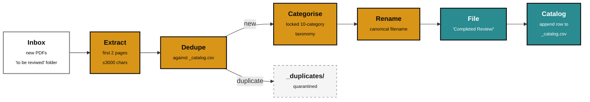

<div align="center">

<picture>
  <source media="(prefers-color-scheme: dark)" srcset="https://raw.githubusercontent.com/shard-BRAINS/.github/main/profile/brand-mark-dark-bg.png">
  
</picture>

# BRAINS Research Skill

### A Claude Code skill for curating the BRAINS research library — extract, dedupe, categorise, file.

<br />

[](CHANGELOG.md)
[](STATUS.yml)
[](#install)
[](LICENSE)
[](https://discord.gg/BEmTXXscBr)
[](https://github.com/shard-BRAINS)

<br />

[Install ↓](#install) · [Pipeline ↓](#pipeline) · [Commands ↓](#commands) · [Configuration ↓](#configuration) · [Taxonomy ↓](#the-locked-taxonomy)

</div>

---

A Claude Code skill that maintains the BRAINS research library — a curated, categorised corpus of PDFs covering AI, neurodiversity, ethics, mental health, and related domains. Runs the inbox-to-library pipeline (extract → dedupe → categorise → rename → file → append catalog) against a locked 10-category taxonomy.

> **Reliable, affirming, inclusive.**

**An Incubator project from [BRAINS](https://github.com/shard-BRAINS) — built by neurodivergent minds, for neurodivergent people.**

---

## Pipeline



Idempotent at every step: re-running over the same inbox is safe. The catalog is append-only; the taxonomy is locked.

---

## Commands

| Command | What it does | Status |
|---|---|---|
| `/brains-research-process` | Full ingest workflow: extract → dedupe → categorise → rename → file → append catalog |  |
| `/brains-research-status` | Read-only summary: total catalogued, count by category, recent additions, inbox + duplicate counts, integrity check |  |

The integrity check surfaces both directions of drift: catalog rows pointing at files that no longer exist, and PDFs on disk that the catalog doesn't know about.

---

## Install

### One-line installers (recommended)

**Windows** (Command Prompt or PowerShell):

```
.\install\install.cmd
```

The wrapper handles PowerShell's default execution policy automatically — no system setting changed. To invoke PowerShell directly:

```powershell
powershell -ExecutionPolicy Bypass -File .\install\install.ps1
```

**macOS / Linux:**

```bash
bash install/install.sh
```

### Manual install

```bash
# 1. Clone
git clone https://github.com/shard-BRAINS/BRAINS-Research-Skill.git
cd BRAINS-Research-Skill

# 2. Create + activate a virtual environment
python -m venv .venv
#    Windows:
.venv\Scripts\activate
#    macOS / Linux:
source .venv/bin/activate

# 3. Install with dev dependencies
pip install -e ".[dev]"

# 4. Copy config and set research_root
cp config.json.example config.json
```

**Install the skill bundle for Claude Code:**

```bash
# Copy (most users)
cp -r . ~/.claude/skills/brains-research/

# Symlink (edits take effect immediately)
ln -s "$(pwd)" ~/.claude/skills/brains-research

# Copy the slash commands into ~/.claude/commands/
cp commands/brains-research-process.md ~/.claude/commands/
cp commands/brains-research-status.md ~/.claude/commands/
```

---

## Configuration

Edit `config.json` to point `research_root` at your Research folder. The default targets the BRAINS share at `\\192.168.1.101\Singularity_Backup\Research`. All other paths are resolved relative to `research_root`.

```json
{
  "research_root": "\\\\192.168.1.101\\Singularity_Backup\\Research",
  "inbox_dir": "to be reviwed",
  "completed_dir": "Completed Review",
  "duplicates_dir": "_duplicates",
  "catalog_csv": "_catalog.csv",
  "extract_pages": 2,
  "extract_max_chars": 3000
}
```

---

## The locked taxonomy

Ten categories. See [`references/taxonomy.md`](references/taxonomy.md) for the full definitions. **The taxonomy is doctrine, not configuration** — the skill will refuse to silently invent a new category. If a paper doesn't fit, it asks the user to confirm a re-categorisation or to extend the taxonomy explicitly.

This is deliberate. The library's value is in its consistent shape over time; a drifting taxonomy is a broken library.

---

## Run the tests

```bash
pytest
```

---

## Where this fits in BRAINS

This is a **BRAINS Incubator** project — internal infrastructure that keeps the team's research base curated, consistent, and queryable across many sessions and many contributors. It pairs naturally with the rest of the BRAINS toolkit: research feeds the weekly intelligence brief, the brand methodology, and the certification rubric work.

| | |
|---|---|
|  | New projects, partnerships, prototypes — see the [BRAINS org page](https://github.com/shard-BRAINS) |
|  | Sister skill — [ND-aware résumé toolkit](https://github.com/shard-BRAINS/BRAINS-resume-skill) |
|  | Companion delivery tooling — [agentic end-to-end builds](https://github.com/shard-BRAINS/BRAINS-build-platform) |
|  | Join the BRAINS Community — [discord.gg/BEmTXXscBr](https://discord.gg/BEmTXXscBr) |

If you'd like to use the skill on your own research collection, or contribute, see the Incubator application process at the [org page](https://github.com/shard-BRAINS#apply-to-join-the-incubator), or jump straight into [the Discord](https://discord.gg/BEmTXXscBr).

---

## Contributing

Contributions are welcome. Read [`CONTRIBUTING.md`](CONTRIBUTING.md) before opening a pull request — it covers identity-first language requirements, the code of conduct, and how to propose new taxonomy categories or pipeline steps.

---

## Licence

MIT — see [LICENSE](LICENSE).

---

<div align="center">

<br />

**Built by neurodivergent minds, for neurodivergent people.**

<br />

[](https://brainscertified.com)

</div>
